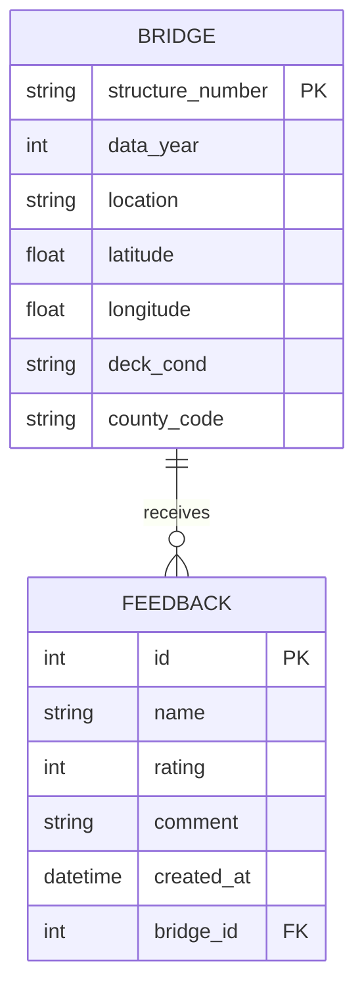

# PA Bridge Information Dashboard


**Live Demo**: [https://python-project-pa-bridge.onrender.com](https://python-project-pa-bridge.onrender.com)

## 1. Project Overview
This project is a full-stack web application designed to monitor and visualize the structural health of highway bridges in Pennsylvania. Utilizing the National Bridge Inventory (NBI) dataset, it provides engineers and the public with an interactive tool to assess infrastructure conditions.

The application is built with **Django** and features a responsive dashboard that integrates **Leaflet.js** for geospatial mapping and **Chart.js** for statistical analysis. It includes a complete data pipeline, from raw data ingestion to a user-friendly frontend, and is fully containerized for portability.

## 2. Key Features
*   **Interactive Dashboard**:
    *   **Geospatial Map**: Visualizes bridge locations with color-coded markers indicating condition (Green=Good, Orange=Fair, Red=Poor).
    *   **Data Filtering**: Allows users to filter bridge data by inspection year.
    *   **Statistical Charts**: Displays real-time bar charts of bridge deck conditions.
*   **Bridge Detail & Feedback**:
    *   Detailed view of individual bridge specifications (Location, Length, Material, etc.).
    *   **User Feedback System**: A form allowing users to submit maintenance reports or comments, which are stored in the database.
*   **Data Management**:
    *   **Excel Export**: One-click export of filtered datasets to `.xlsx` format.
    *   **Admin Interface**: Full backend management for Bridges and Feedback records.
*   **DevOps & Engineering**:
    *   **Dockerized**: Fully portable development environment.
    *   **CI/CD**: Automated testing and building via GitHub Actions.
    *   **Cloud Deployment**: Deployed on Render.com.

## 3. Database Schema (ERD)
The application uses a relational database with two primary entities:



## 4. How to Run (Usage Guide)

### Option A: Live Demo (Cloud Deployment)
Simply visit the deployed application:
**[https://python-project-pa-bridge.onrender.com](https://python-project-pa-bridge.onrender.com)**
*(Note: The free tier server may take 2-3 minutes to wake up on first access.)*

### Option B: Local Docker Setup
This ensures the environment matches exactly what was developed.

1.  **Clone the repository**:
    ```bash
    git clone https://github.com/lwangmy-12/Python_Project.git
    cd Python_Project
    ```

2.  **Run with Docker Compose**:
    ```bash
    cd web_app
    docker-compose up --build
    ```

3.  **Access the App**:
    Open your browser and go to `http://localhost:8000`.

### Option C: Manual Local Setup
1.  Install dependencies: `pip install -r web_app/requirements.txt`
2.  Run migrations: `python web_app/manage.py migrate`
3.  Import data: `python web_app/manage.py import_bridges`
4.  Start server: `python web_app/manage.py runserver`

## 5. Testing & CI/CD

### Local Testing
To verify the application logic locally, run the test suite:

**Using Docker (Preferred):**
```bash
cd web_app
docker-compose exec web pytest
```

**Using Local Python:**
```bash
cd web_app
pytest
```

### GitHub Actions
This repository includes a CI/CD pipeline (`.github/workflows/build.yml`) that automatically:
1.  Sets up a Python environment.
2.  Installs dependencies.
3.  Runs the full `pytest` suite.
4.  Builds the Docker image to ensure portability.

You can view the build status by clicking the "Actions" tab in the GitHub repository.

## 6. Deployment Details
The application is deployed on **Render.com** using Docker.
*   **Build Process**: The `Dockerfile` handles dependency installation, database migration, and data importation automatically on startup.
*   **Static Files**: Served efficiently using `Whitenoise`.

